# Fizzbuzz-in-C-language
FizzBuzz をC言語で実装してみよう。

1から順に数を数え上げてゆき、3の倍数なら「Fizz」、5の倍数なら「Buzz」、両方の倍数（15の倍数）なら「Fizz Buzz」、いずれでもなければその数を出力する。
   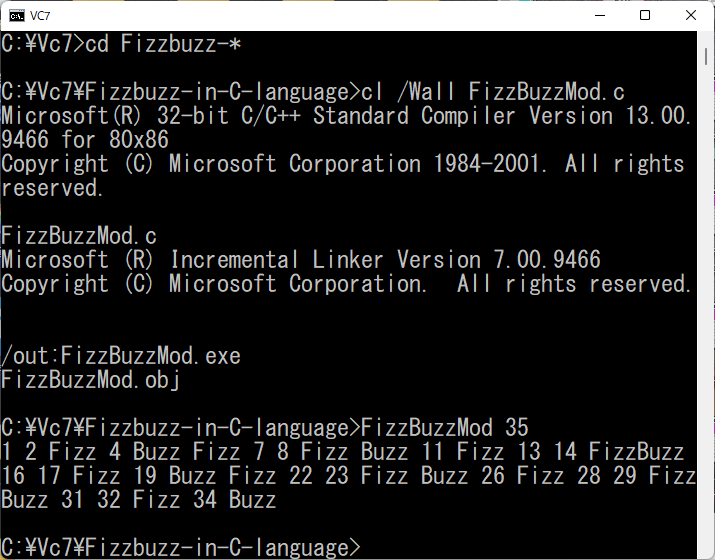
### お品書き
1. 剰余で判定
   1. 割合素直版・・・・・・・・・・・・・・[FizzBuzzMod.c](FizzBuzzMod.c)
   1. 再帰呼び出し版・・・・・・・・・・・・[FizzBuzzModRec.c](FizzBuzzModRec.c)
   1. printf() の戻り値で判定・・・・・・・・[FizzBuzzModRet.c](FizzBuzzModRet.c)
   1. 三項演算子でがんばってみる・・・・・・[FizzBuzzModTri.c](FizzBuzzModTri.c)
   1. バッファ操作版文字列関数を駆使・・・・[FizzBuzzModBuf.c](FizzBuzzModBuf.c)
   1. 文字列を玩ぶ・・・・・・・・・・・・・[FizzBuzzModStr.c](FizzBuzzModStr.c)
   1. 標準ライブラリの div を利用する・・・・[FizzBuzzModDiv.c](FizzBuzzModDiv.c)
   1. 剰余を自前で実装する（無駄）・・・・・[FizzBuzzModOwn.c](FizzBuzzModOwn.c)
   1. 剰余を自前で実装する２（ネタだ）・・・[FizzBuzzModOwn2.c](FizzBuzzModOwn2.c)
   1. 短絡評価版（使っちゃダメ）・・・・・・[FizzBuzzModSce.c](FizzBuzzModSce.c)
1. カウンタで判定・・・・・・・・・・・・・・[FizzBuzzCnt.c](FizzBuzzCnt.c)
1. オフセットで判定
   1. 到達値・・・・・・・・・・・・・・・・[FizzBuzzOfs.c](FizzBuzzOfs.c)
   1. 目標値・・・・・・・・・・・・・・・・[FizzBuzzOfs2.c](FizzBuzzOfs2.c)
1. シフトで判定
   1. 1ビットの1を右シフトする・・・・・・・[FizzBuzzShlr.c](FizzBuzzShlr.c)
   1. 1ビットの1を左シフトする・・・・・・・[FizzBuzzShll.c](FizzBuzzShll.c)
   1. 指折り数えてみる（右シフトだけどね）・[FizzBuzzFin.c](FizzBuzzFin.c)
1. 排他的論理和で判定・・・・・・・・・・・・[FizzBuzzExor.c](FizzBuzzExor.c)
1. 論理積で判定・・・・・・・・・・・・・・・[FizzBuzzAnd.c](FizzBuzzAnd.c)
1. 循環配列で判定・・・・・・・・・・・・・・[FizzBuzzArr.c](FizzBuzzArr.c)
1. i%15 が循環することに気づいた？
   1. Switch 文判定・・・・・・・・・・・・・[FizzBuzzSw.c](FizzBuzzSw.c)
   1. テーブル参照・・・・・・・・・・・・・[FizzBuzzTbl.c](FizzBuzzTbl.c)
   1. 関数ポインタ配列参照・・・・・・・・・[FizzBuzzFnc.c](FizzBuzzFnc.c)
   1. 最大公約数を利用・・・・・・・・・・・[FizzBuzzGcd.c](FizzBuzzGcd.c)
1. 十進数操作（まどろっこい）・・・・・・・・[FizzBuzzDec.c](FizzBuzzDec.c)
1. 三角関数で判定・・・・・・・・・・・・・・[FizzBuzzSin.c](FizzBuzzSin.c)
1. ファイル操作版・・・・・・・・・・・・・・[FizzBuzzFile.c](FizzBuzzFile.c)
1. GR-SAKURA(RX63N)でFizzBuzz・・・・・・・[FizzBuzz.c](FizzBuzz.c)

   仕様変更：　1~15を2進数でLEDに表示　15：^ド　3: ミ　5:ソ　その他:ド　を発音する
   
   クロック設定関数 initBASE() は自前で用意してください。
   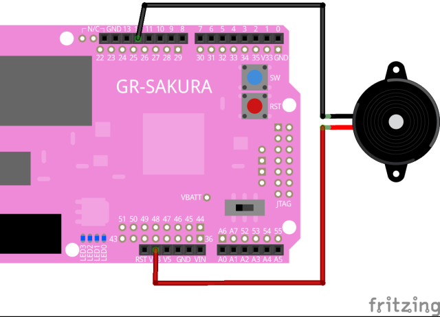
   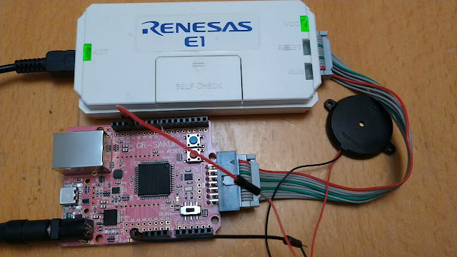
   
1. WIO TERMINAL(ATSAMD51)でFizzBuzz・・・・[FizzBuzz.ino](FizzBuzz.ino)

   C言語じゃなくArduinoのスケッチ(何を隠そうC++)だけどね。"30" の "FizzBuzz" でバグってる。 ”Fizz" と "Buzz" の間にスペースが入っている。俺のせいじゃない。  　
  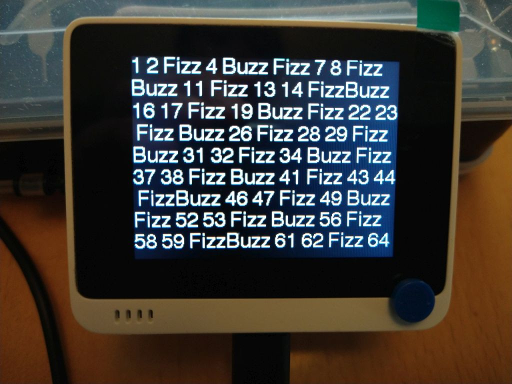
  
1. NUCLEO-F411RE(STM32F411RE)でFizzBuzz・・[FizzBuzz.cpp](FizzBuzz.cpp)

   こいつもC++だ。出力が更に貧弱なので、USBシリアルでPCのターミナルエミュレータに文字を投げる。きょうび Web 上で開発可能だ。[Mbed Online Compiler](https://os.mbed.com/docs/mbed-os/v6.15/quick-start/build-with-the-online-compiler.html)
   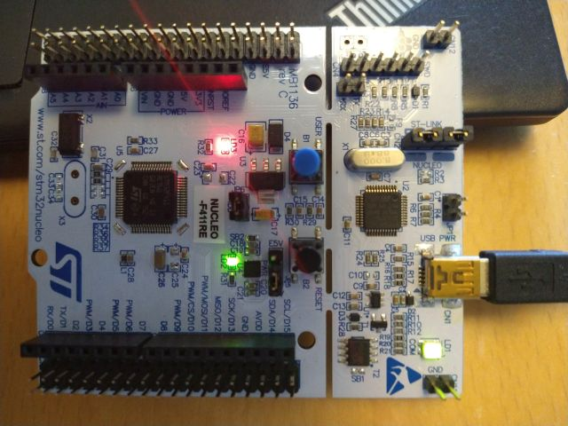
   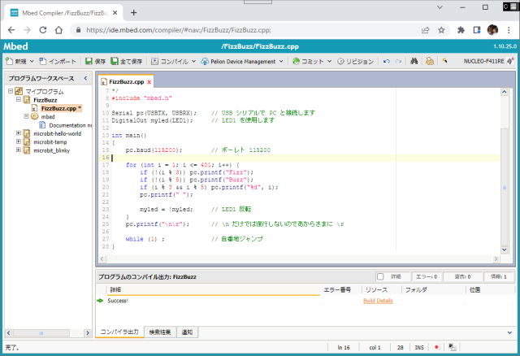
   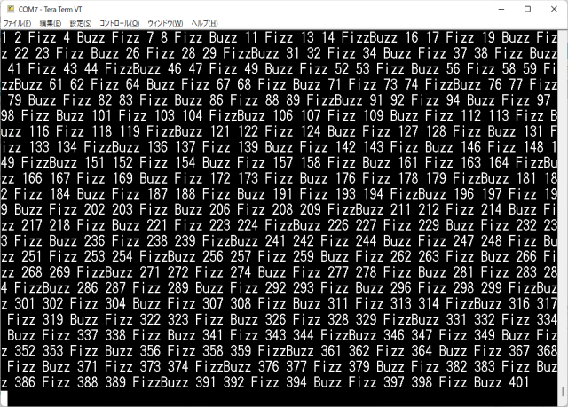

1. micro bit(nRF51822)でFizzBuzz・・・・・・[FizzBuzzMbit.cpp](FizzBuzzMbit.cpp)

   [Mbed Online Compiler](https://os.mbed.com/docs/mbed-os/v6.15/quick-start/build-with-the-online-compiler.html) は micro bit もビルドできる。
   
   [Microsoft MakeCode for micro:bit](https://makecode.microbit.org/?lang=ja)じゃなくともC++で構築する方法もあるんだ。
   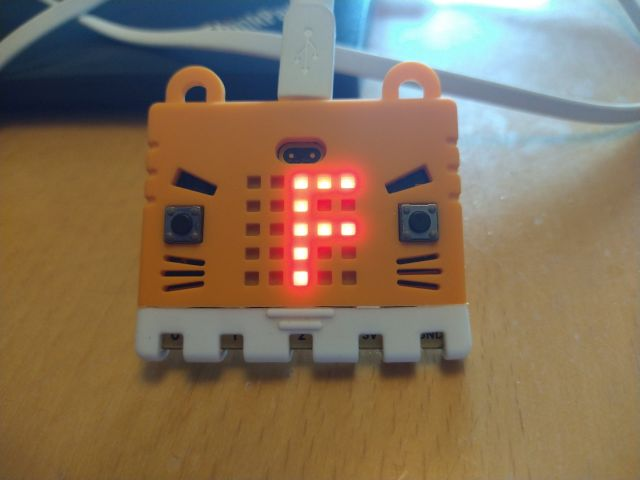

1. PDP11/45 unixV7 でFizzBuzz・・・・・・・・[FizzBuzzUNIX7.cpp](FizzBuzzUNIX7.cpp)

PDP11/45 UNIX V7 でFizzBuzz。実機があるわけではない。Windows 11 上の WSL2 上の debian bullseye 上の simh PDP11/45 エミュレータ上の UNIX V7 で実行してみる。

   難儀な点

   1. CコンパイラがK&Rだ。
   1. この当時バックスペースはない。　
      "#"がそれに相当する。#include の # はエスケープが必要。
      当時テレタイプが主流だからカーソルが戻ると読みにくい。
   1. この当時まだスクリーンエディタ vi がない。
      ラインエディタ ed でちまちま入力する。
      stdin から cat で流し込むけどね。
   1. この当時 stdlib.h はまだない。
      atoi() は K&R ではサンプルコードとして掲載されている。
   1. この当時の cc はエラーチェックを手抜きしている。
      lint コマンドによるエラーチェックが必須。
  
   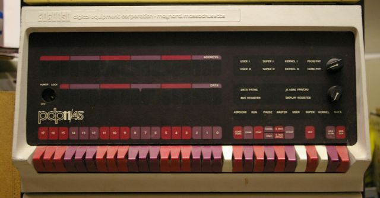
   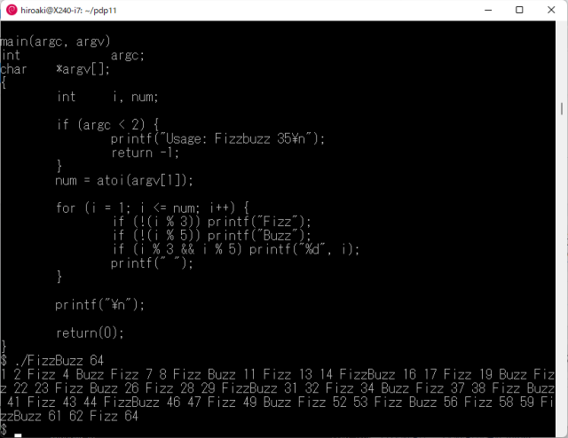

17. MC68000 CP/M68K で FizzBuzz・・・・・・・・[FizzBuzzCPM68K.c](FizzBuzzCPM68K.c)

MC68000 CP/M68K で FizzBuzz。実機があるわけではない。Windows 11 上の WSL2 上の debian bullseye 上の musashi MC68000エミュレータ上の CP/M-68K で実行してみる。現状の git ソースは makefile がめちゃくちゃで build 不能。某所に古いのがあったのでそれを利用。本来、CP/M-68K の Cコンパイラは、CP68（プリプロセッサ）～C068（パーサ）～C168（コードジェネレータ）～AS68（アセンブラ）～LO68（リンカ）と個別に処理しなければならなかったはずだが、CC コマンド一発で .REL（リロケータブル実行ファイル）が生成される。

   難儀な点

   1. CコンパイラがK&Rだ。ま、時期的にそうだろうな。
   1. エディタが ED か uEMACS しかない。新渡戸 EMACS に弱い。

   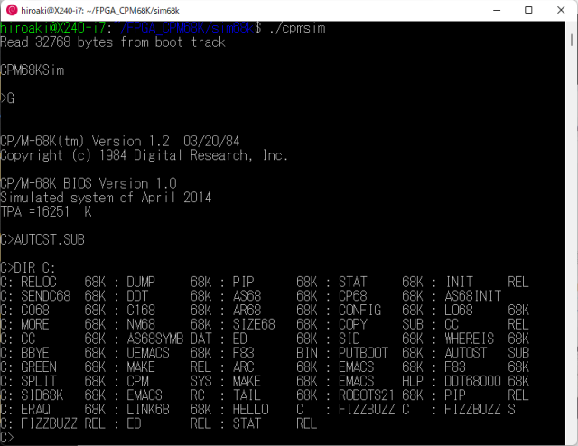
   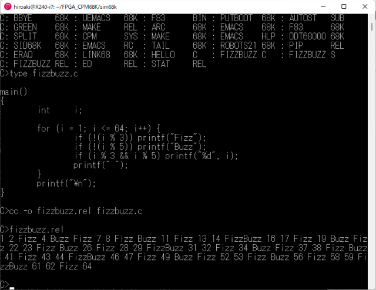
   
18. J3100 DOSV で FizzBuzz・・・・・・・・[FizzBuzzDOSBOX.c](FizzBuzzDOSBOX.c)

J3100 DOSV で FizzBuzz。実機はあるが納戸の肥やし。Windows 11 上の WSL2 上の debian bullseye 上の DOSBOXJエミュレータ上の DOS で実行してみる。DOSBOXJ すげー　こいつら本気だ。昔所有していたJ3100SGTのハードディスクの内容をKERMIT（RS232C）でサルベージしたデータであっさり動いた。MIFESエディタも何の細工も無しで動いた。サルベージしたデータには、microsoft c v6.00a と Borland Turbo C++ v1.01 がインストール済みである。今回は MC6 で。

   [Salvage HDD data of J3100SGT101](https://www.saigyo.org/blog/index.php?mode=pages&aim=Salvage) データサルベージの顛末

   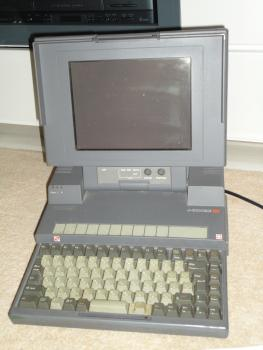
   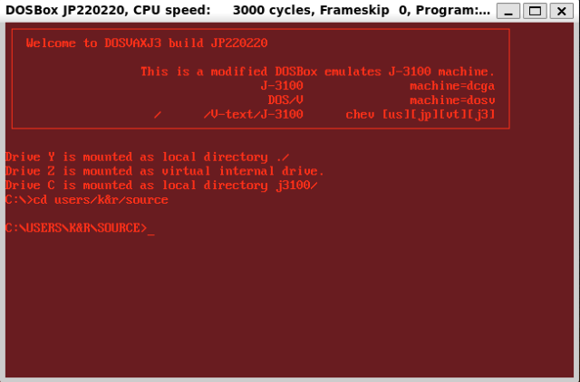
   
   
19. MAC(MC68000) で FizzBuzz・・・・・・・・・・・[FizzBuzzVMAC.c](FizzBuzzVMAC.c)

MAC(MC68000) で FizzBuzz。実機はもうない。ヤフオクで売っ払っちまった。Windows 11 上の Mini vMac エミュレータで実行してみる。LightspeedC 3.0.2 改め THINK C 3.0.2 である。エディタは勝手に起動して勝手に動く。何者かは分からない。キーは配列が微妙に違う。設定の仕方が分からない。探り探りだ。

   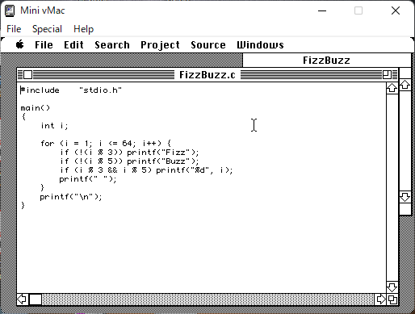
   
   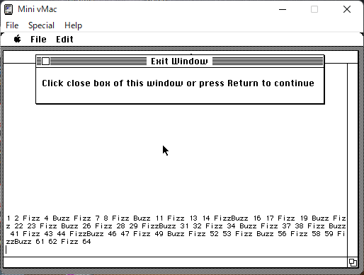

20. Altair8800(Z80) で FizzBuzz・・・・・・・・・・・[FizzBuzzCPM80.c](FizzBuzzCPM80.c)

Altair8800(Z80) で FizzBuzz。実機はない。Windows 11 上の simh Z80エミュレータで実行してみる。エディタは ED しかない。orz　Cコンパイラは BDS-C である。リンカ clink でリンクしてあげないと実行ファイルが出来ない。

   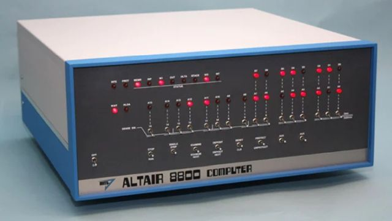
   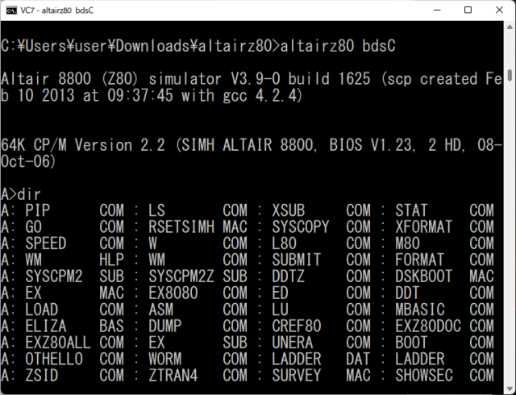
   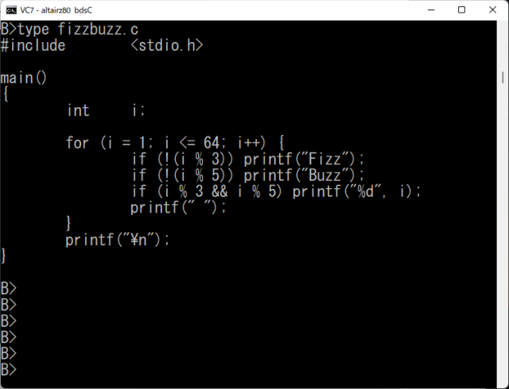
   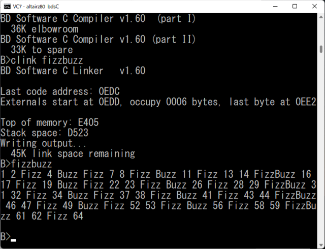

21. FreeDOS で FizzBuzz・・・・・・・・・・・・・[FizzBuzzFDOS.c](FizzBuzzFDOS.c)

FreeDOS で FizzBuzz。Windows 11 上の Oracle VM  VirtualBox 上の FreeDOS で実行してみる。

   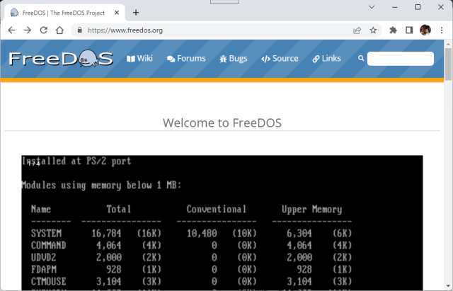
   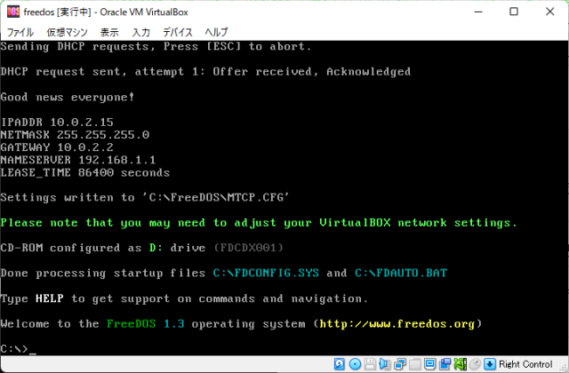
   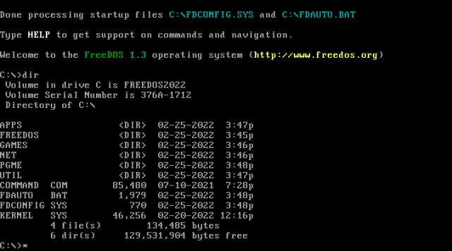
   
   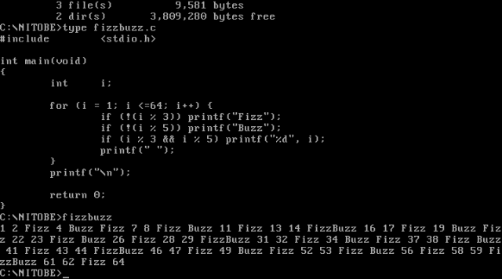
   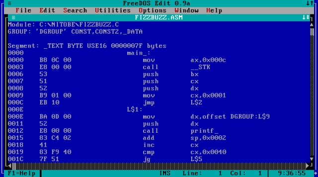
