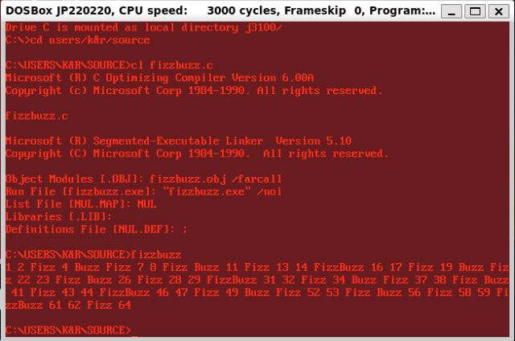
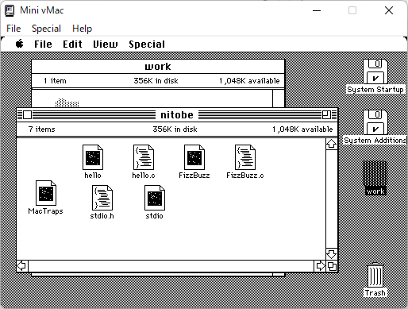
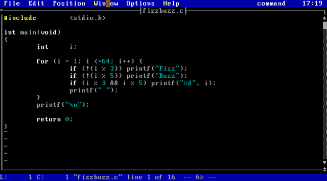
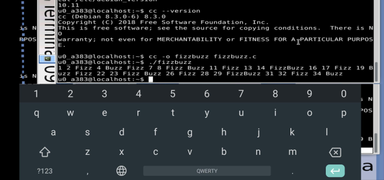

# Fizzbuzz-in-C-language
FizzBuzz をC言語で実装してみよう。

1から順に数を数え上げてゆき、3の倍数なら「Fizz」、5の倍数なら「Buzz」、両方の倍数（15の倍数）なら「Fizz Buzz」、いずれでもなければその数を出力する。
   
### お品書き
1. 剰余で判定
   1. 割合素直版・・・・・・・・・・・・・・[FizzBuzzMod.c](FizzBuzzMod.c)
   1. へそ曲がり版・・・・・・・・・・・・・[FizzBuzzMod24.c](FizzBuzzMod24.c)
   1. 再帰呼び出し版・・・・・・・・・・・・[FizzBuzzModRec.c](FizzBuzzModRec.c)
   1. フラグを利用・・・・・・・・・・・・・[FizzBuzzModFlag.c](FizzBuzzModFlag.c)
   1. printf() の戻り値で判定・・・・・・・・[FizzBuzzModRet.c](FizzBuzzModRet.c)
   1. 三項演算子でがんばってみる・・・・・・[FizzBuzzModTri.c](FizzBuzzModTri.c)
   1. 純粋三項演算子版　・・・・・・・・・・[FizzBuzzModTriPure.c](FizzBuzzModTriPure.c)
   1. 純粋三項演算子版２・・・・・・・・・・[FizzBuzzModTriPure2.c](FizzBuzzModTriPure2.c)
   1. バッファ操作版文字列関数を駆使・・・・[FizzBuzzModBuf.c](FizzBuzzModBuf.c)
   1. 文字列を玩ぶ・・・・・・・・・・・・・[FizzBuzzModStr.c](FizzBuzzModStr.c)
   1. 文字列を玩ぶ２・・・・・・・・・・・・[FizzBuzzModStr2.c](FizzBuzzModStr2.c)
   1. 文字列を玩ぶ３・・・・・・・・・・・・[FizzBuzzModStr3.c](FizzBuzzModStr3.c)
   1. 標準ライブラリの div を利用する・・・・[FizzBuzzModDiv.c](FizzBuzzModDiv.c)
   1. 剰余を自前で実装する（無駄）・・・・・[FizzBuzzModOwn.c](FizzBuzzModOwn.c)
   1. 剰余を自前で実装する２（ネタだ）・・・[FizzBuzzModOwn2.c](FizzBuzzModOwn2.c)
   1. 短絡評価版（使っちゃダメ）・・・・・・[FizzBuzzModSce.c](FizzBuzzModSce.c)
1. カウンタで判定
   1. カウンタで判定その１・・・・・・・・・・[FizzBuzzCnt.c](FizzBuzzCnt.c)
   1. カウンタで判定その２・・・・・・・・・・[FizzBuzzCnt2.c](FizzBuzzCnt2.c)
1. オフセットで判定
   1. 到達値・・・・・・・・・・・・・・・・[FizzBuzzOfs.c](FizzBuzzOfs.c)
   1. 目標値・・・・・・・・・・・・・・・・[FizzBuzzOfs2.c](FizzBuzzOfs2.c)
1. シフトで判定
   1. 1ビットの1を右シフトする・・・・・・・[FizzBuzzShlr.c](FizzBuzzShlr.c)
   1. 1ビットの1を左シフトする・・・・・・・[FizzBuzzShll.c](FizzBuzzShll.c)
   1. 指折り数えてみる（右シフトだけどね）・[FizzBuzzFin.c](FizzBuzzFin.c)
1. 排他的論理和で判定・・・・・・・・・・・・[FizzBuzzExor.c](FizzBuzzExor.c)
1. 論理積で判定
   1. 下駄を履かせて２の冪乗でラウンドアップ・・[FizzBuzzAnd.c](FizzBuzzAnd.c)
   1. １を左ローテートして４種のマスクと＆・・・[FizzBuzzRot.c](FizzBuzzRot.c)
1. 循環配列で判定・・・・・・・・・・・・・・[FizzBuzzArr.c](FizzBuzzArr.c)
   1. ループの中で判断をしない新井田教授版・・[FizzBuzzNIIDA.c](FizzBuzzNIIDA.c)
1. i%15 が循環することに気づいた？
   1. Switch 文判定・・・・・・・・・・・・・[FizzBuzzSw.c](FizzBuzzSw.c)
   1. テーブル参照・・・・・・・・・・・・・[FizzBuzzTbl.c](FizzBuzzTbl.c)
   1. テーブル参照２・・・・・・・・・・・・[FizzBuzzTbl2.c](FizzBuzzTbl2.c)
   1. テーブル参照３・・・・・・・・・・・・[FizzBuzzTbl3.c](FizzBuzzTbl3.c)
   1. 関数ポインタ配列参照・・・・・・・・・[FizzBuzzFnc.c](FizzBuzzFnc.c)
   1. 最大公約数を利用・・・・・・・・・・・[FizzBuzzGcd.c](FizzBuzzGcd.c)
1. 十進数操作（まどろっこい）・・・・・・・・[FizzBuzzDec.c](FizzBuzzDec.c)
1. 三角関数で判定・・・・・・・・・・・・・・[FizzBuzzSin.c](FizzBuzzSin.c)
1. ファイル操作版・・・・・・・・・・・・・・[FizzBuzzFile.c](FizzBuzzFile.c)
1. ロゼッタコードでちょっと気になるFizzBuzz
   1. FizzBuzzR1 ・・・・・・・・・・・・・[FizzBuzzRC1.c](FizzBuzzRC1.c)
   1. FizzBuzzR2 ・・・・・・・・・・・・・[FizzBuzzRC2.c](FizzBuzzRC2.c)
   1. FizzBuzzR3 (Vc7ではコンパイルできない)・・[FizzBuzzRC3.c](FizzBuzzRC3.c)
   1. FizzBuzzR4 ・・・・・・・・・・・・・[FizzBuzzRC4.c](FizzBuzzRC4.c)
   1. FizzBuzzR5 ・・・・・・・・・・・・・[FizzBuzzRC5.c](FizzBuzzRC5.c)
1. GR-SAKURA(RX63N)でFizzBuzz・・・・・・・[FizzBuzz.c](FizzBuzz.c)

   仕様変更：　1~15を2進数でLEDに表示　15：^ド　3: ミ　5:ソ　その他:ド　を発音する
   
   クロック設定関数 initBASE() は自前で用意してください。
   
   
   
1. WIO TERMINAL(ATSAMD51)でFizzBuzz・・・・[FizzBuzz.ino](FizzBuzz.ino)

   C言語じゃなくArduinoのスケッチ(何を隠そうC++)だけどね。"30" の "FizzBuzz" でバグってる。 ”Fizz" と "Buzz" の間にスペースが入っている。俺のせいじゃない。  　
  
  
1. NUCLEO-F411RE(STM32F411RE)でFizzBuzz・・[FizzBuzz.cpp](FizzBuzz.cpp)

   こいつもC++だ。出力が更に貧弱なので、USBシリアルでPCのターミナルエミュレータに文字を投げる。きょうび Web 上で開発可能だ。[Mbed Online Compiler](https://os.mbed.com/docs/mbed-os/v6.15/quick-start/build-with-the-online-compiler.html)
   
   
   

1. micro bit(nRF51822)でFizzBuzz・・・・・・[FizzBuzzMbit.cpp](FizzBuzzMbit.cpp)

   [Mbed Online Compiler](https://os.mbed.com/docs/mbed-os/v6.15/quick-start/build-with-the-online-compiler.html) は micro bit もビルドできる。
   
   [Microsoft MakeCode for micro:bit](https://makecode.microbit.org/?lang=ja)じゃなくともC++で構築する方法もあるんだ。
   

1. PDP11/45 unixV7 でFizzBuzz・・・・・・・・[FizzBuzzUNIX7.c](FizzBuzzUNIX7.c)

PDP11/45 UNIX V7 でFizzBuzz。実機があるわけではない。Windows 11 上の WSL2 上の debian bullseye 上の simh PDP11/45 エミュレータ上の UNIX V7 で実行してみる。

   難儀な点

   1. CコンパイラがK&Rだ。
   1. この当時バックスペースはない。　
      "#"がそれに相当する。#include の # はエスケープが必要。
      当時テレタイプが主流だからカーソルが戻ると読みにくい。
   1. この当時まだスクリーンエディタ vi がない。
      ラインエディタ ed でちまちま入力する。
      stdin から cat で流し込むけどね。
   1. この当時 stdlib.h はまだない。
      atoi() は K&R ではサンプルコードとして掲載されている。
   1. この当時の cc はエラーチェックを手抜きしている。
      lint コマンドによるエラーチェックが必須。
  
   
   

17. MC68000 CP/M68K で FizzBuzz・・・・・・・・[FizzBuzzCPM68K.c](FizzBuzzCPM68K.c)

MC68000 CP/M68K で FizzBuzz。実機があるわけではない。Windows 11 上の WSL2 上の debian bullseye 上の musashi MC68000エミュレータ上の CP/M-68K で実行してみる。現状の git ソースは makefile がめちゃくちゃで build 不能。某所に古いのがあったのでそれを利用。本来、CP/M-68K の Cコンパイラは、CP68（プリプロセッサ）～C068（パーサ）～C168（コードジェネレータ）～AS68（アセンブラ）～LO68（リンカ）と個別に処理しなければならなかったはずだが、CC コマンド一発で .REL（リロケータブル実行ファイル）が生成される。

   難儀な点

   1. CコンパイラがK&Rだ。ま、時期的にそうだろうな。
   1. エディタが ED か uEMACS しかない。新渡戸 EMACS に弱い。

   
   
   
18. J3100 DOSV で FizzBuzz・・・・・・・・[FizzBuzzDOSBOX.c](FizzBuzzDOSBOX.c)

J3100 DOSV で FizzBuzz。実機はあるが納戸の肥やし。Windows 11 上の WSL2 上の debian bullseye 上の DOSBOXJエミュレータ上の DOS で実行してみる。DOSBOXJ すげー　こいつら本気だ。昔所有していたJ3100SGTのハードディスクの内容をKERMIT（RS232C）でサルベージしたデータであっさり動いた。MIFESエディタも何の細工も無しで動いた。サルベージしたデータには、microsoft c v6.00a と Borland Turbo C++ v1.01 がインストール済みである。今回は MC6 で。

   [Salvage HDD data of J3100SGT101](https://www.saigyo.org/blog/index.php?mode=pages&aim=Salvage) データサルベージの顛末

   
   
   
   
19. MAC(MC68000) で FizzBuzz・・・・・・・・・・・[FizzBuzzVMAC.c](FizzBuzzVMAC.c)

MAC(MC68000) で FizzBuzz。実機はもうない。ヤフオクで売っ払っちまった。Windows 11 上の Mini vMac エミュレータで実行してみる。LightspeedC 3.0.2 改め THINK C 3.0.2 である。エディタは勝手に起動して勝手に動く。何者かは分からない。キーは配列が微妙に違う。設定の仕方が分からない。探り探りだ。

   
   
   
   
2022/07/15 追記

THINK C はアセンブラソース出力オプションが無い。というか見つけられなかった。
MacsBug を手に入れた。デバッガである。FizzBuzz を実行し割り込みをかける。MacsBugが走るので逆アセンブルしてみる。
剰余は DIVS を使っている。 DIVS はディスティネーションレジスタの上位16ビットに剰余、下位16ビットの商が入る。SWAP して TST.W すれば、剰余==0 を判定できる。

   

20. Altair8800(Z80) で FizzBuzz・・・・・・・・・・・[FizzBuzzCPM80.c](FizzBuzzCPM80.c)

Altair8800(Z80) で FizzBuzz。実機はない。Windows 11 上の simh Z80エミュレータで実行してみる。エディタは ED しかない。orz　Cコンパイラは BDS-C である。リンカ clink でリンクしてあげないと実行ファイルが出来ない。

   
   
   
   

21. FreeDOS で FizzBuzz・・・・・・・・・・・・・[FizzBuzzFDOS.c](FizzBuzzFDOS.c)

FreeDOS で FizzBuzz。Windows 11 上の Oracle VM  VirtualBox 上の FreeDOS 1.3 で実行してみる。なんと未だにメンテナンスされている。スクリーンエディタ EDIT 、VIM が同梱されている。新渡戸 vi は得意だ。同梱されている Cコンパイラは watcom C 。アセンブラソース出力オプションが無いなぁ・・・と思っていたら、逆アセンブラ wdis で .obj ファイルを処理して .asm ファイルにリダイレクトすれば得られる。
ときに、起動画面で DHCP で IPアドレスを取得しているが、何をする気だ freedos ！

   
   
   
   
   
   

22. FreeDOS で FizzBuzz 2・・・・・・・・・・・・・[FizzBuzzFDOS.c](FizzBuzzFDOS.c)

FreeDOS が動いているうちに LSI-C（試食版）の挙動を確認しておこう。K&R「プログラミング言語C」（第2版ではない）の「付録B」に、BDS-C か LSI-C で試してみぃ・・・と書いてある。ソースは前項と一緒。
仮想FDの取り扱いで結構苦労しました。

   

23. FreeDOS で FizzBuzz 3・・・・・・・・・・・・・[FizzBuzzFDOS.c](FizzBuzzFDOS.c)

Trying to make the hippo dance is not really a lot of fun.（カバにダンスを踊らせるのは、あまり楽しいことではない）。
というわけで、カバにダンスを踊らせてみよう。djgpp（gcc）はボーナスCDに同梱されている。環境設定でちょっと苦労。ソースは前項と一緒。
exe のサイズを比較してみよう。動作は全部一緒（に見える）。

        1. watcom c   8,800
        2. Bruce's C  3,300
        3. LSI C     12,087
        4. gcc       80,770

カバだ。

   

24. FreeDOS で FizzBuzz 4・・・・・・・・・・・・・[FizzBuzzFDOS.c](FizzBuzzFDOS.c)

子曰、温故而知新、可以為師矣。というわけで、Aztec C と Lattice C の登場である。野放図にCコンパイラをインストールしてきたので環境変数が干渉しだした。コマンド入力をフルパスにして頑張る。

Lattice C は .obj の生成までだ。リンカは Microsoft 8086 Object Linker を呼び出している。なるほどね。このあと、Lattice C は Microsoft C になってしまう。

exe のサイズを比較してみよう。選択するライブラリで大幅に変化するであろう。が、全て標準のライブラリを使用。動作は全部一緒（に見える）。

        1. watcom c   8,800
        2. Bruce's C  3,300
        3. LSI C     12,087
        4. gcc       80,770
        5. Aztec C   16,099
        6. Lattice C 15,682

   
   
   
   
25. debian で FizzBuzz ・・・・・・・・・・・・・[FizzBuzzDebian.c](FizzBuzzDebian.c)

OSと畳は新しい方が良い。というわけで、windows11 上の WSL2 上の debian bullseye 上の三種のコンパイラを比較してみる。FizzBuzzを100万回回すソースファイルをコンパイルして、そのコンパイル時間、実行ファイルサイズ、実行時間を計測する。コンソール出力は /dev/null にリダイレクトして捨てる。

   | コンパイラ | コンパイル時間 | 実行ファイルサイズ | 実行時間 |
   | ---------- | ------------: | -----------------: | -------: |
   | gcc debian 10.2.1-6 | 0.340s | 16664byte | 0.060s |
   | debian clang 11.0.1-2 | 0.370s | 16584byte | 0.059s |
   | tcc version 0.9.27 | 0.013s | 3244byte | 0.117s |

実行速度は gcc、clang が速い。コンパイル時間、実行ファイルサイズは tcc に軍配が上がった。

   
   
   
 26.  Family Computer と GameBoy で FizzBuzz ・・・・・・ [FizzBuzzFC.c](FizzBuzzFC.c) [FizzBuzzGB.c](FizzBuzzGB.c)

人生にリセットボタンはない。コンティニューはある。by ラコスケ（どうぶつの森）というわけで、ファミリーコンピュータとゲームボーイで FizzBuzz 。実機はとっくのとおに無い。windows11 上の DOS窓上の、cc65, gbz80 開発環境と nesterj, BGB エミュレータで実行する。

   
   

 27.  【番外編】Nintendo Switch で FizzBuzz ・・・・・・ [FIZZBUZZ.BAS](FIZZBUZZ.BAS)

「ハードはソフトを遊んでもらうために仕方なく買ってもらう箱である」by 任天堂元社長山内溥 というわけで、息子がお年玉で仕方なく買った Switch を取り上げて、プチコン４（SmileBASIC 4.4.5）をインストールしてFizzBuzz。BASIC なんて40年ぶりに触ったわ。

リファレンスマニュアルの「制御命令」が＠ラベル～ GOTO から始まる。スパゲティプログラマ養成ギブスだ。

   
   

 28. moto g9 (Android) で FizzBuzz ・・・・・・[FizzBuzzDebian.c](FizzBuzzDebian.c)

Talk is cheap. Show me the code.おしゃべりはいいから、コード見せろよ。Linus Torvalds（リーナス・トーバルズ）というわけで、Moto g9 (Android) で、お出かけ先で Fizzbuzz。昔は Android の root を奪取して debian をインストールするという荒業が必要だったが、今は、debian noroot というアプリがある。いい時代だなぁ。

   
   
   
   

 29. 【番外編】Androidアプリ で FizzBuzz

「画面は青かった」[通信用語の基礎知識](https://www.wdic.org/w/SCI/画面は青かった) というわけで、Androidアプリに FizzBuzz はないだろうか・・・あった。ゲーム版はムズイぞ。

   
   
   
   

　30. 【番外編】Android Studio で FizzBuzz・・・・・・[MainActivity.java](MainActivity.java)　[activity_main.xml](activity_main.xml)

「そう囁くのよ、私のゴーストが。」草薙素子　というわけで、私のゴーストが Android Studio で FizzBuzzアプリを作れと囁くのでやってみた。手に入れたのは Android Studio Bumblebee | 2021.1.1 Patch 「トランスフォーマー」かい？オブジェクト指向ではない爺様はひいひい言いながら JAVA でコーディングする。右下のエミュレータで動いた動いた。気が済んだ。

.java は修正追加箇所をコメントできるが、.xmlのタグの中はコメントできない。activity_main.xml 追加したのは、L9、L14。

   

　31. 【番外編】kotlin で FizzBuzz・・・・・・[fizzbuzz.kt](fizzbuzz.kt)　[FizzBuzz.java](FizzBuzz.java)
 
 へんじがない。ただの　しかばね　のようだ。前項の Android Studio は java がデフォルトだが、kotlin の選択肢もある。コトリンって何だ？今後 kotlin による Android の開発が増えてくるのだそうだ。
 
 Kotlinで書かれたコードはJVM（Java Virtual Machine：Java仮想マシン）で動作するJavaバイトコード（おなじみのclassファイル）へコンパイルされる。このようなプログラミング言語をJVM言語と呼ぶことがある。
 
kotrinc javac は .class ファイルを生成するコンパイラ。kotlin java は JVM。つまり、kotlin = java。スクリーンショットを見ていただくと分るが、コンパイルされた .class ファイルは相互で実行可能。

   
   

　32.  RISC-V で FizzBuzz・・・・・・[FizzBuzzRISCV.c](FizzBuzzRISCV.c)
 
No! Try not. Do. Or do not. There is no try. (Yoda) というわけで、RISC-V を試してみる。WSL2 上で QEMU やら TinyEmu なんかをトライしてみたが、web上で試せるじゃないか！

[JSLinux](https://bellard.org/jslinux/)

おお、RISC-V のアセンブリ言語だ！

   
   
   
   

33. 【番外編】FM11 OS9 BASIC09 で FizzBuzz・・・・・・[FizzBuzzFM11](FizzBuzzFM11)

I got a bad feeling about this.(Han Solo) というわけで、FM11エミュレータ OS9 basic09 で FizzBuzz 。
Microware C Compiler で試したかったが、ネット上に落ちているわけもなく、標準装備の basic09 で実装。
日付に 22/07/15　と入力すると、 July 15, 1922 となる。2000年問題未対応だ。

[FM11](http://nanno.bf1.jp/softlib/man/fm11/)

   
   

34. X68000 Human68k XC で FizzBuzz・・・・・・[FizzBuzzX68k.c](FizzBuzzX68k.c)[FizzBuzzX68k.s](FizzBuzzX68k.s)

Don't think... feel...(Yoda) というわけで、 XM6(X68000エミュレータ）on　Win11　/ Human68k / XC で FizzBuzz 。
/Fs オプションでアセンブラソースが見られる。68000ニーモニックだ。おっと、剰余は DIVS を使わず、浮動小数点ライブラリを呼んでやがる。

[XM6](http://retropc.net/pi/xm6/index.html)

   
   
   
   
35. RaspberryPi3 で FizzBuzz・・・・・・[FizzBuzzRBP3.c](FizzBuzzRBP3.c)　[FizzBuzzRBP3.s](FizzBuzzRBP3.s)

I love you.(Leia Organa)　I know.(Han Solo) というわけで、 RaspberryPi3 で FizzBuzz。armv6 のニーモニックが見たかったんだな。
なんと！[FizzBuzzModOwn2.c](FizzBuzzModOwn2.c) と同様のアルゴリズムを用いて自前で i%3 i%5 を実装してる。

   
   
   

36.【番外編】Julia で Fizzbuzz ・・・・・[FizzBuzzJulia.jl](FizzBuzzJulia.jl)

朝には紅顔ありて夕には白骨となれる云々（五帖御文・蓮如）というわけで、RaspberryPi4上 の Julia で FizzBuzz。
Julia の string の連結は「*」、繰り返しは「＾」である。true は「1」、false は「0」なので文字列のOn/Offができる。
   
   
37. 【番外編】Python で FizzBuzz・・・[FizzBuzzPython.py](FizzBuzzPython.py)

"Everything that has a beginning has an ending."　/ Agent Smith(MATRIX) というわけで、python で FizzBuzz。
python での strings の反復は「*」、連結は「+」。三項演算子は変態。
   
   
38.【番外編】JavaScript で Fizzbuzz・・・[FizzBuzzJS.html](FizzBuzzJS.html)

ふるさとは遠きにありて思ふもの「小景異情」(室生犀星)  というわけで、javaScript で FizzBuzz。
   

39. RONGAN NANO で FizzBuzz・・・[FizzBuzzRONGAN.c](FizzBuzzRONGAN.c)

Über den Bergen weit zu wandern / Sagen die Leute, wohnt das Glück.　"Über den Bergen"(Karl Busse) というわけで、Sipeed Longan Nano RISC-V GD32VF103CBT6 で FizzBuzz。SIPEED USB-JTAG/TTL RISC-V DEBUG を経由している。開発環境は Visual Studio Code。
   
   
   
   
40. テーブルをまわすFizzBuzz・・・[FizzBuzzTbl2.c](FizzBuzzTbl2.c)

「まわるまわるよ時代はまわる」（時代 1975 中島みゆき）というわけでテーブルをまわすFizzBuzz
   

41. 【番外編】WhiteSpace で Fizzbuzz 

Alles Sichtbare haftet am Unsichtbaren – 2120 Traktat vom Licht / Fragmente II (Novalis 1771-1801) 
すべての見えるものは見えないものにさわっている - 2120 光についての論文 / 断片集II (ノヴァーリス 1771-1801) 
というわけで。WhiteSpase で FizzBuzz。 
FizzBuzz.ws
 
 
 
 
 
 
なに？見えない？そりゃそうだ。スペースとタブと改行だけで記述されている。これでどうだ。 
FizzBuzz.wsv
ssstnnssssnsnssnssssttntsttntsstnssststntsttntssnsnstnstnsnnnssstnssstsssttsntnsssssttstsstntnssnsttnssststntsttntssnnsnnnsssnssstsssstsntnssssstttststntnssnsttnnsnnnsstnsssttttstsnsnstnsstnssntnnssnssstsssssntnssssstntssssnssssttsststntsstnttssnssststsntnssnnn

それでも分からない？しょうがないなぁ。hex dump でどうよ？
実はコーディングはWhiteSpaceアセンブラで記述してアセンブルして.wsファイルを生成している。
アセンブラソースはこちら。[FizzBuzz.wss](FizzBuzz.wss)
  
  
42.【番外編】Sell で FizzBuzz ・・・・・[FizzBuzz.sh](FizzBuzz.sh)

Mon oreille est un coquillage 
Qui aime le bruit de la mer 
( Jean Cocteau, Cannes V ) 
私の耳は　貝の殻 
海の響を懐かしむ 
( 堀口大學 訳 ) 
というわけでLinux Sell コマンド（bash）でFizzBuzz。 
今回は、seq sed tr echo で実装してみた。 

seq 100 | sed '0\~3 s/.*/Fizz/; 0\~5 s/[0-9]*$/Buzz/' | tr '\n' ' ' ; echo 

43.【番外編】M0sense で FizzBuzz・・・・[FizzBuzzM0sense.c](FizzBuzzM0sense.c)

議論するだけなら議員は大勢いる。実行が問題になるとだれもいなくなる。（ジャン・ド・ラ・フォンテーヌ 1621～1695）
というわけで M0sense で FizzBuzz。IDE 未対応。linux CUI でビルドする。
[sipeed M0sense](https://wiki.sipeed.com/hardware/en/maixzero/sense/maix_zero_sense.html)

43.【番外編】M0sense で FizzBuzz・・・・[FizzBuzzM0sense.c](FizzBuzzM0sense.c)

議論するだけなら議員は大勢いる。実行が問題になるとだれもいなくなる。（ジャン・ド・ラ・フォンテーヌ 1621～1695）
というわけで M0sense で FizzBuzz。IDE 未対応。linux CUI でビルドする。
[sipeed M0sense](https://wiki.sipeed.com/hardware/en/maixzero/sense/maix_zero_sense.html)

44.【番外編】ATTiny10でFizzBuzz・・・・[FizzBuzzATTiny10.c](FizzBuzzATTiny10.c)

「途に倒れて だれかの名を呼び続けたことが ありますか」（わかれうた／中島みゆき／1977-9-10）
というわけで、往年の「米粒マイコン」ATTiny10でFizzBuzz。10年前のマイコンだ。ネット上の情報は殆ど当時のものなので使えない。
  1. Microchip Studio 7 (Version: 7.0.2594 - )で ATTiny10 は「GCC C Executable Project」でビルド可能。
  2. 書き込みは avrdude 。但しライタ（KKHMF USB AVRプログラマ USBaspライタ 5152）のファームウエアは古いので更新が必要。[avrdude.log](avrdude.log)
  3. Windows Driver 強制変更の Zadig は必須。
  4. このマイコンには UART がない。ソフトウエアで 800us タイマを使って 1200ボー送信を行う。
  5. RS232CインターフェースはTTLレベル直結。お？動くんだ！レベル変換しなくても動く！

「米粒マイコン」ざっくりスペック
https://avr.jp/user/DS/PDF/tiny10.pdf
  + コア： tinyAVR(8bit)
  + 電源電圧： 1.8 ～ 5.5V
  + クロック： 12MHz(8MHz@2.7V、8MHz オシレータ内蔵)
  + プログラムメモリ(NVM)： 1024 bytes(512 words)
  + SRAM： 32 bytes
  + 汎用レジスタ： 16個
  + GPIO： 4pin
  + ADC： 8bit 4ch
  + タイマ： 1ch
  + WDT： 16ms ～ 8s 周期
  + 動作電流： 200μA(活動時 1MHz, 1.8V)、0.1μA以下(パワーダウン時 1.8V)

45.【番外編】RA4M1-CLICKER でFizzBuzz・・・・[FizzBuzz.py](FizzBuzz.py)

「世の中はいつも 変わっているから頑固者だけが 悲しい思いをする」（世情／中島みゆき／1978年4月10日）というわけで、RA4M1-CLICKER でFizzBuzz。Renesas の比較的新しい RA マイコンである。ベアメタルで開発、HAL(Hardware Abstraction Layer)で開発、MicroPython で開発・・・いくつかのアプローチがあるが、ベアメタルは面倒、HAL9000 は好きだが、HALは冗長なので嫌い。今回は流行りの MicroPython 開発に挑戦してみよう。

 1. MicroPython Firmware を J-Flash Lite でマイコンに書き込む
 2. 今回はシリアルIFを FT232RL でまじめにドライブする
 3. IDE「THONNY」でコーデイング／ダウンロード／実行

「RA4M1-CLICKER」ざっくりスペック 
+ 32-bit ARM® Cortex®-M4
　R7FA4M1AB3CFM MCU operating at up to 48MHz, 256KB of Flash memory, and 32KB of SRAM
+ USB Type-C connector
+ Two LEDs, two pushbuttons, and a reset button
+ J-Link OB and headers for interfacing with external electronics
+ mikroBUS socket for adding Click board
+ Small, affordable, yet powerful starter development kit
+ Mounting holes simplify integration
+ Compact design with clear and descriptive silkscreen markings

[RA4M1-CLICKER](https://www.mikroe.com/ra4m1-clicker)

[MicroPython Firmware](https://micropython.org/download/EK-RA4M1/)

[SEGGER J-Links](https://www.segger.com/downloads/jlink/)

[thonny v4.1.1](https://github.com/thonny/thonny/releases/tag/v4.1.1)

46.【番外編】Arduino UNO R4 MinimaでFizzBuzz・・・・[FizzBuzz_UnoR4.ino](FizzBuzz_UnoR4.ino)

「なぜ　めぐり逢うのかを　私たちは　なにも知らない」（糸／中島みゆき／1998年2月4日）というわけで、Arduino UNO R4 Minima でFizzBuzz。実は前項の RA4M1 搭載である。2022年6月14日 Renesas は Arudino に1000万米ドルを出資、一年後の今年満を持しての発売となった。 

 1. 実機とPCをUSBで接続
 2. Arduino IDE 2.1.1 をインストール
 3. コーデイング／ダウンロード／実行　朝飯前だ

「Arduino UNO R4 Minima」ざっくりスペック

+ マイコン：Renesas RA4M1（Arm Cortex-M4）
+ USB：USB-C（プログラミングポート / HID）
+ ピン：
  + 14 x デジタルI/O
  + 6 x アナログ入力
  + 1 x DAC
  + 6 x PWM
  + Misc（SWDコネクタ）
+ 通信：
  + 1 x UART
  + 1 x I2C
  + 1 x SPI
  + 1 x CAN（要外部トランシーバー）
+ 電源：
  + 動作電圧：5 V
  + 入力電圧（VIN）：6～24 V
  + DC電流（各I/Oピン毎）：8 mA
+ クロック：48 MHz
+ メモリ（RA4M1）：256 KBフラッシュ、32 KB RAM
+ 寸法：68.85 mm x 53.34 mm（幅 x 長さ）

[Arduino UNO R4 Minima](https://store.arduino.cc/products/uno-r4-minima)

